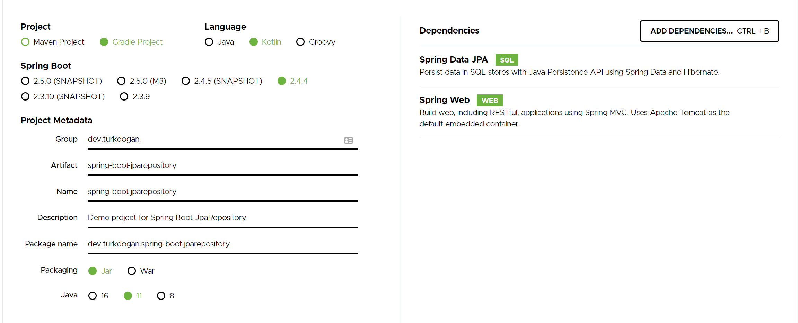

# Spring Boot JpaRepository Tutorial
In this post, we will dive into the JPA Repository implementation of the Spring Framework. Spring provides a strong infrastructure for database operations. It generates necessary queries in the background so that the database operations are abstracted. In addition to the crud operations, other database features such as pagination can be implemented event without writing single line of query code.

In this post, we will create a coin model to show some of the JpaRepository features like querying, pagination, filtering, and deletion. The implementation of this project can be found at https://github.com/turkdogan/spring-boot-guide.

## Create Project
Spring initializr provides templates for Spring Boot projects. Let's open https://start.spring.io/ and select Gradle Projects from the Project section. As a programming language, we will be using Kotlin for this post. Finally, we should add Spring Web and Spring Data JPA dependencies. The selected choices should be as shown below:



## Entity Model
Coins are pretty popular nowadays, let's use a coin model for demo purposes. Though a real-world coin model is highly complex, we will create a simplified one by using just two tables: coin and price. The coin table keeps the basic information of the coin such as name and starting date. The price model is used to keep the price values of each coin for each day. As a result, we can say that our model is one-to-many; many price values are kept for each coin.

```kotlin
@Entity
class Coin {

    @Id
    @GeneratedValue
    var id: UUID? = null

    @Column(nullable = false, unique = true)
    var name: String = ""

    @Column
    var description: String = ""

    @CreatedDate
    var created = Instant.now()

    @LastModifiedDate
    var updated = Instant.now()

    @Column(nullable = false)
    var startDate: Instant? = null

    @OneToMany(cascade = [CascadeType.ALL])
    @JoinColumn(name = "coin_id")
    var priceList: MutableList<Price> = mutableListOf()
}
```

Each entity has a generated UUID as a primary key. We use Spring's built-in features to manage create and update data automatically.

```kotlin
@Entity
class Price {

    @Id
    @GeneratedValue
    var id: UUID? = null

    @Column(nullable = false)
    var value: BigDecimal = BigDecimal.ZERO

    @Column(nullable = false)
    var date: Instant? = null
}
```
Price entity keeps the price data of the coin. Assume that we have a single data value for each day (This would not a good model for a real-world use-case). 

## JpaRepository for Coin
This is the crucial part. A default JpaRepository can be used for the following purposes:
* Bring all coins
* Bring a specific coin by id
* Delete coin
* Update coin // TODO
* . . .

In addition to the previous ones, by defining a simple method; the followings can be performed by implementing a JpaRepository:
* Bring all coins sorted by an attribute (i.e. name)
* Bring all coins sorted by attributes (i.e. sorted by name ascending, sorted by created date descending)
* Bring subset of coins by given interval and sorting parameters
* Bring all coins having some attributes (i.e, name)
* . . .

For example, to retrieve the coin 5 (having the name value is coin 5), we can define a method as shown below:

```kotlin
    fun findAllByOrderByNameDesc(): List<Coin>
```

Spring automatically generates the necessary queries in the background and returns all the coin data cored by name in ascending order. Let's implement the repository.

```kotlin
@Repository
interface CoinRepository : JpaRepository<Coin, UUID> {

    fun findAllByOrderByNameDesc(): List<Coin>

    fun findAllByOrderByStartDateDesc(page: Pageable): List<Coin>

    fun findAllByOrderByDescriptionDescNameAsc(): List<Coin>

    fun findByName(name: String): Optional<Coin>
}
```

Though the structure is intuitive, let's analyze this file line by line. The first line is Repository annotation coming from the Spring specification. During the initialization phase, Spring creates this component under the Spring context. From now on, other Spring components (i.e. services) can inject this object easily. The second line defines a coin interface by extending the interface of JpaRepository. As mentioned before, the magic comes from this JpaRepository. The remaining lines are method definitions to retrieve the relevant values from the database.

While defining the query methods, some conventions must be followed. 
For example, if "title" does not exist in the Coin entity, then the following method definition will not work (actually Spring gives an error during the loading):

```kotlin
@Repository
interface CoinRepository : JpaRepository<Coin, UUID> {

    fun findAllByOrderByTitleDesc(): List<Coin>

    fun findByTitle(name: String): Optional<Coin>
}
```

## Initializing the Demo Data
In order to retrieve the coin prices, we need demo data. Therefore, in the beginning of the application running, we create 10 coin and 10 price information for each coin (for the last 10 days). The price values are generated randomly, therefore we do not have any inter-dependency between days.

```kotlin
@Component
class CoinDataLoader : ApplicationRunner {

    @Autowired
    private lateinit var coinRepository: CoinRepository

    override fun run(args: ApplicationArguments?) {
        for (i in 1..10) {
            val c = Coin()
            c.name = "coin $i"
            c.startDate = Instant.now().minus(i.toLong(), ChronoUnit.DAYS)
            c.description = "Description"

            for (d in 1..10) {
                val day = Instant.now().minus(d.toLong(), ChronoUnit.DAYS)
                val value = Random().nextDouble() * 100
                val price = Price()
                price.date = day
                price.value = BigDecimal.valueOf(value)
                c.priceList.add(price)
            }
            coinRepository.save(c)
        }
        coinRepository.flush()
    }
}
```
Description values are the same for each coin, so that we can see the results according to the second value ordering. // TODO

## Retrieving the Data
Let's design a rest controller so that we can query the items by using our repository.

```kotlin
@RestController
class CoinRestController {

    @Autowired
    lateinit var coinRepository: CoinRepository

    @GetMapping("/")
    fun getCoins(): List<Coin> {
        return coinRepository.findAll()
    }

    @GetMapping("/coinsSortedByNameDesc")
    fun getCoinsSortedByName(): List<Coin> {
        return coinRepository.findAllByOrderByNameDesc()
    }

    @GetMapping("/coinByName")
    fun getCoinByName(coinName: String): Coin {
        return coinRepository.findByName(coinName).get()
    }

    @GetMapping("/coinsByOrderByDescriptionDescNameAsc")
    fun getCoinsByMultipleSortParameters(): List<Coin> {
        return coinRepository.findAllByOrderByDescriptionDescNameAsc()
    }

    @GetMapping("/getFirstNCoins")
    fun getFirstCoins(count: Int): List<Coin> {
        return coinRepository.findAll(PageRequest.of(0, count)).content
    }

    @GetMapping("/getLastNCoins")
    fun getLastCoins(count: Int): List<Coin> {
        return coinRepository.findAllByOrderByStartDateDesc(PageRequest.of(0, count))
    }
}
```
Please note that this implementation is for just demo-purpose. Normally, exception handling, logging and other production approaches would be used. 

We have implemented a couple of rest methods to handle the relevant resource. 

Finally, let's start the Spring with gradle (./gradlew in MacOS and Linux).

```terminal
gradlew bootRun
```

If the application starts without any issue, a database is created and initialized with the demo data. From now on, we can use any rest client to call the rest interface so that we can observe the incoming data in JSON format. In the demo project, a pure Javascript implementation of a typical rest client is found. After starting the server if you open the page http://localhost:8080/index.html, then you can use the buttons to see the response of each implementation. For example, if you click the "Get coin 1", the first coin with price info is returned server and displayed on the screen. A typical coin data should be displayed similar to this one:

```json
{
  "id": "b96da21b-7381-4a3d-9d7a-906fa5dfbdb6",
  "name": "coin 1",
  "description": "Description",
  "created": "2021-04-18T14:42:10.199346Z",
  "updated": "2021-04-18T14:42:10.199346Z",
  "startDate": "2021-04-17T14:42:10.199346Z",
  "priceList": [
    {
      "id": "6eb8ac23-850a-4a2d-a6a2-98ba3c3fcd17",
      "value": 72.85,
      "date": "2021-04-17T14:42:10.199346Z"
    },
    {
      "id": "6eb4bf49-a6e2-462b-afd8-41d35165d8d8",
      "value": 8.81,
      "date": "2021-04-16T14:42:10.199346Z"
    },
    {
      "id": "2e9ea1dc-845a-46bd-bc26-5b32be6300e7",
      "value": 30.62,
      "date": "2021-04-15T14:42:10.199346Z"
    },
    {
      "id": "19dccf5c-fc41-4d08-87a7-0cb6d4dd45ab",
      "value": 55.18,
      "date": "2021-04-14T14:42:10.199346Z"
    },
    {
      "id": "f5bb3e71-0dc6-4075-9eab-2fc89827779b",
      "value": 56.23,
      "date": "2021-04-13T14:42:10.199346Z"
    },
    {
      "id": "f069d0db-c07b-4342-b432-591469af208f",
      "value": 99.25,
      "date": "2021-04-12T14:42:10.199346Z"
    },
    {
      "id": "a36584d4-3286-4c24-9fff-6638edba7095",
      "value": 98.39,
      "date": "2021-04-11T14:42:10.199346Z"
    },
    {
      "id": "9b0f0009-ee70-4d5d-a99d-e4376681b577",
      "value": 95.33,
      "date": "2021-04-10T14:42:10.199346Z"
    },
    {
      "id": "a75c22f8-8751-436c-bf6d-b87e26320859",
      "value": 2.44,
      "date": "2021-04-09T14:42:10.199346Z"
    },
    {
      "id": "eff8bd12-4a75-4a9a-b70a-d9a86f1daa90",
      "value": 94.13,
      "date": "2021-04-08T14:42:10.199346Z"
    }
  ]
}
```
You can look at the "index.html" file for further details. In the next post, we will design a simple front end by using pure Javascript and HTML.